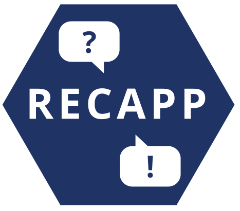
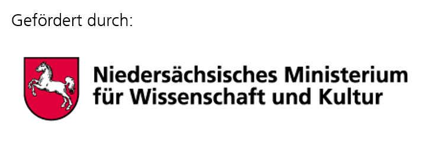

# RECAPP

## What is Recapp?

Recapp is a collaborative quiz tool designed for university teaching. It is built around a
learning-through-teaching approach: instead of the teacher writing all the questions,
**students write the quiz questions themselves** — and then answer each other's questions
when the teacher starts the quiz session.

This makes Recapp fundamentally different from conventional quiz tools: students are both
authors and participants, which requires a deeper engagement with the material than simply
answering pre-made questions.

**For teachers:** create a quiz, let students populate it with questions, approve them,
start the session, and monitor live statistics.

**For students:** write questions during the editing phase, then answer your fellow
students' questions during the quiz run. You can also comment on and upvote questions.

Participation works either via university OpenID Connect accounts or anonymously via
browser fingerprint — no registration required for guests.

## Setup instructions

Run `npm install`und init your repo with `lerna bootstrap`. Note that this repo uses _npm workspaces_, so make sure to always add packages with `-w MODULE` to the individual projects.

Also make sure to create a `.env.development` (or `.env.production`) file from the `.env.template` in the repo.

Make sure to edit the `.env` file in the frontend project to the proper URIs.

### Model generator

There is simple generator for new data schemas/models if needed. It can be called via `npx pinion generators/model.template.ts`.

See also our [Installation Guide](INSTALLATION.de.md) (at the moment, German only)

## Contributing

**recapp** is a free and open-source project. Therefore, we warmly welcome your suggestions, bug reports, or, in the best case, code contributions! For more information, see
[CONTRIBUTING](CONTRIBUTING.md).

Maintainers and contributors must follow this repository’s [CODE OF
CONDUCT](CODE_OF_CONDUCT.md).

## ENTWICKLUNG UND FÖRDERUNG

Die Entwicklung von RECAPP wurde mit Mitteln des Niedersächsischen Ministeriums für Wissenschaft und Kultur gefördert. Die initiale Entwicklung erfolgte an der Georg-August-Universität Göttingen.

 
