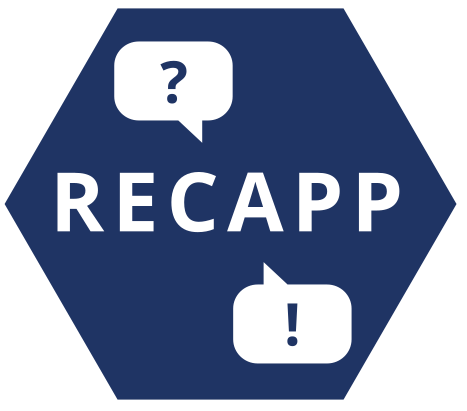
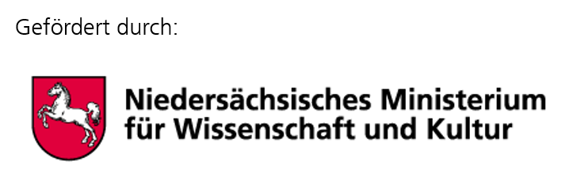
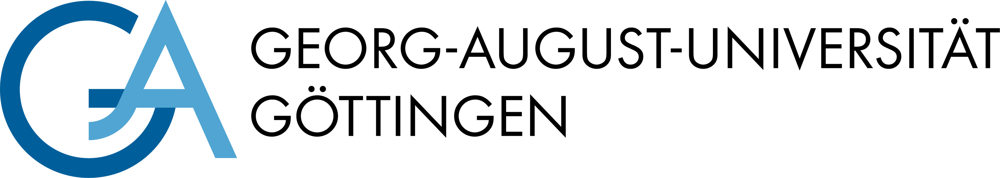

# RECAPP

## What is Recapp?

Recapp is a collaborative quiz tool designed for teaching. It is built around a
learning-through-teaching approach: instead of the teacher writing all the questions,
**students write the quiz questions themselves** — and then answer each other's questions
when the teacher starts the quiz session.

This makes Recapp fundamentally different from conventional quiz tools: students are both
authors and participants, which requires a deeper engagement with the material than simply
answering pre-made questions.

**For teachers:** create a quiz, let students populate it with questions, approve them,
start the session, and monitor live statistics.

**For students:** write questions during the editing phase, then answer your fellow
students' questions during the quiz run. You can also comment on and upvote questions.

Participation works either via OpenID Connect accounts or anonymously via
browser fingerprint — no registration required for guests.

## Documentation

- **[User Guide](https://ecomod-code.github.io/recapp/)** — how to use Recapp as a teacher or student.
- **[Installation Guide](INSTALLATION.md)** — self-hosting Recapp on your own server (Docker Compose + Caddy).

## Contributing

**recapp** is a free and open-source project. Therefore, we warmly welcome your suggestions, bug reports, or, in the best case, code contributions! For more information, see [CONTRIBUTING](CONTRIBUTING.md).

Maintainers and contributors must follow this repository’s [CODE OF CONDUCT](CODE_OF_CONDUCT.md).

## Development & Funding

Die Entwicklung von RECAPP wurde mit Mitteln des Niedersächsischen Ministeriums für Wissenschaft und Kultur gefördert. Die initiale Entwicklung erfolgte an der Georg-August-Universität Göttingen.

*The development of RECAPP was funded by the Lower Saxony Ministry of Science and Culture (Niedersächsisches Ministerium für Wissenschaft und Kultur). Initial development took place at the University of Göttingen.*

 
